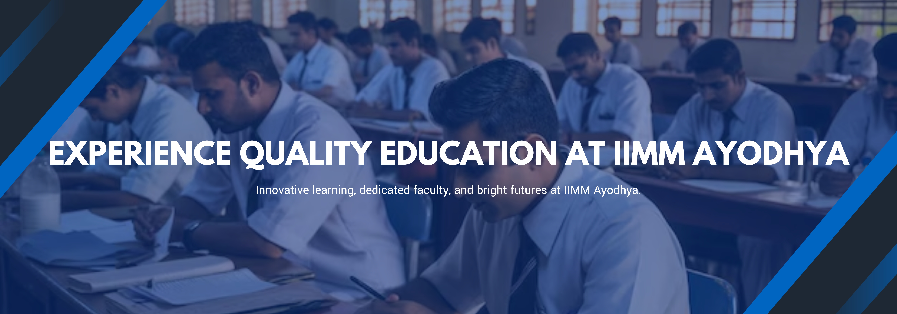

# 🏛️ IIMM Ayodhya Branch – Professional Website

<div align="center">
  
</div>

This is a responsive and modular website built using **React.js** and **Tailwind CSS** to showcase the newly established **Ayodhya Branch of the Indian Institute of Materials Management (IIMM)**. The website serves as a comprehensive platform to inform, engage, and invite professionals and students to participate in the institute's growth initiatives.

---

## 🌟 Overview

The IIMM Ayodhya Branch website is a modern, feature-rich web application designed to provide an engaging user experience. It showcases the institute's mission, courses, achievements, and facilitates community engagement through interactive components and comprehensive information architecture.

<div align="center">
  
</div>

---

## ✨ Key Features

- ✅ **Responsive Design** – Seamlessly adapts to all device sizes (mobile, tablet, desktop)
- ✅ **Interactive Sliders** – Engaging image carousels for showcasing content
- ✅ **Card-Based Layouts** – Well-organized content sections with visual hierarchy
- ✅ **Modular Components** – Reusable, maintainable React components
- ✅ **Modern UI/UX** – Clean, professional design with smooth animations
- ✅ **Multiple Content Sections** – Announcements, courses, achievements, and team highlights
- ✅ **Contact Integration** – Easy access to contact information and feedback options
- ✅ **Performance Optimized** – Fast loading and optimized media delivery

---

## 📸 Gallery

<div align="center">
  
  
</div>

<div align="center">
  
  
</div>

---

## 📁 Project Structure

```
iimm-ayodhya/
├── public/
│   ├── index.html               # Main HTML entry point
│   └── vite.svg                 # Vite logo
│
├── src/
│   ├── img/                     # All images and media assets
│   │   ├── Logo.png
│   │   ├── achievement*.jpg
│   │   ├── courses*.jpg
│   │   ├── card*.jpg
│   │   └── ...
│   │
│   ├── components/              # Reusable React Components
│   │   ├── Announce.jsx         # Announcement section
│   │   ├── Card.jsx             # Primary content card
│   │   ├── Card2.jsx            # Secondary card layouts
│   │   ├── Card3.jsx            
│   │   ├── Card4.jsx
│   │   ├── Card5.jsx
│   │   ├── CardSlider.jsx       # Horizontal scrollable carousel
│   │   ├── CardSlider1.jsx      # Alternative slider variant
│   │   ├── Footer.jsx           # Footer with contact & links
│   │   ├── Header.jsx           # Hero/banner section
│   │   ├── Navbar.jsx           # Navigation bar
│   │   ├── Navbar.css           # Navigation styles
│   │   ├── CardSlider.css       # Carousel styles
│   │   ├── Slider.jsx           # Main image slider
│   │   └── NameCard.jsx         # Team member card
│   │
│   ├── pages/
│   │   ├── Home.jsx             # Main landing page
│   │   ├── About.jsx            # About page
│   │   ├── ContactUs.jsx        # Contact page
│   │   └── form.jsx             # Form page
│   │
│   ├── App.jsx                  # Root component
│   ├── App.css                  # App styles
│   ├── main.jsx                 # React DOM mount point
│   └── index.css                # Global styles
│
├── .gitignore                   # Git ignore rules
├── eslint.config.js             # ESLint configuration
├── index.html                   # Vite HTML template
├── package.json                 # Project dependencies
├── README.md                    # This file
└── vite.config.js               # Vite configuration
```

---

## 🚀 Getting Started

### Prerequisites

Before you begin, ensure you have the following installed:
- **Node.js** (v14.0 or higher)
- **npm** (v6.0 or higher) or **yarn**

### Installation & Setup

1. **Clone the repository**
   ```bash
   git clone https://github.com/yourusername/iimm-ayodhya.git
   cd iimm-ayodhya
   ```

2. **Install dependencies**
   ```bash
   npm install
   ```

3. **Start the development server**
   ```bash
   npm run dev
   ```
   The application will be available at `http://localhost:5173`

4. **Build for production**
   ```bash
   npm run build
   ```

5. **Preview production build**
   ```bash
   npm run preview
   ```

---

## 💻 Tech Stack

| Technology | Purpose | Version |
|------------|---------|---------|
| **React** | UI Framework | 18.2.0 |
| **Vite** | Build Tool & Dev Server | 7.0.4 |
| **React Router** | Client-side Routing | 6.17.0 |
| **Tailwind CSS** | Styling Framework | Latest |
| **ESLint** | Code Quality | 9.30.1 |

---

## 🎨 Component Overview

| Component | Description | Features |
|-----------|-------------|----------|
| **Navbar** | Top navigation menu | Responsive, sticky header |
| **Header** | Hero banner section | Full-width with CTA |
| **Card Components** | Content display cards | Multiple layout variants |
| **Sliders** | Image carousels | Auto-play, navigation controls |
| **Footer** | Website footer | Contact info, links, sitemap |
| **Announce** | Announcements section | News & updates showcase |

---

## 📱 Responsive Breakpoints

- **Mobile**: 320px - 768px
- **Tablet**: 769px - 1024px
- **Desktop**: 1025px and above

---

## 📝 Available Scripts

```bash
npm run dev      # Start development server with hot reload
npm run build    # Create optimized production build
npm run lint     # Check code quality with ESLint
npm run preview  # Preview production build locally
```

---

## 🎯 Key Sections

- **Home**: Landing page with hero section and key announcements
- **About**: Information about IIMM and the Ayodhya branch
- **Contact Us**: Contact form and communication channels
- **Courses**: Detailed course offerings and descriptions
- **Team**: Meet the team members and leadership
- **Achievements**: Showcase of milestones and accomplishments

---

## 🔧 Configuration Files

### `vite.config.js`
Vite configuration for optimized development and production builds with React support.

### `eslint.config.js`
Code quality rules following industry best practices and React conventions.

### `tailwind.config.js`
Tailwind CSS customization for design tokens, spacing, colors, and theme extensions.

---

## 🤝 Contributing

Contributions are welcome! To contribute:

1. Fork the repository
2. Create a feature branch (`git checkout -b feature/AmazingFeature`)
3. Commit your changes (`git commit -m 'Add AmazingFeature'`)
4. Push to the branch (`git push origin feature/AmazingFeature`)
5. Open a Pull Request

---

## 📄 License

This project is licensed under the MIT License. See the LICENSE file for more details.

---

## 📧 Contact & Support

For inquiries, feedback, or support, please reach out:

- **Email**: info@iimmayodhya.org
- **Website**: www.iimmayodhya.org
- **Address**: Ayodhya, Uttar Pradesh, India
- **Phone**: +91-XXXXXXXXXX

---

## 🙏 Acknowledgments

- Indian Institute of Materials Management (IIMM) leadership and team
- Contributors and community members
- Modern web development community

---

<div align="center">
  
</div>

<div align="center">
  <strong>Built with ❤️ for the IIMM Ayodhya Community</strong>
  
  
  
  
</div>
